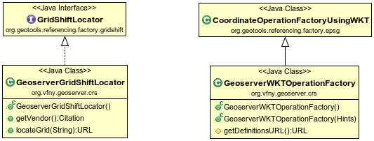

Desenvolupament a GeoServer
===========================

El gruix del desenvolupament s'ha realitzat sobre GeoTools, tenint present la seva adaptabilitat a diversos entorns d'execució. A GeoServer tan sols ha calgut incorporat un parell de classes que, amb un codi mínim, adapten la funcionalitat provista per GeoTools al seu entorn d'execució particular.

Quant a la **transformació de semblança**, no ha calgut realitzar cap modificació a GeoServer. El mòdul de referenciació de GeoTools ja s'encarrega de sel·leccionar aquesta transformació quan cal, i els paràmetres EPSG:5166 ja es troben disponibles a la BDD EPSG provista amb el propi GeoTools.

GeoServer té un directori on s'emmagatzemen totes les dades i configuració del catàleg de serveis publicats, anomenat ``GEOSERVER_DATA_DIR``. Dins d'aquest directori, n'hi ha un altre dedicat a definir els CRS personalitzats, anomenat :file:`user_projections`. S'ha cregut oportú utilitzar aquesta mateixa ubicació perquè els usuaris hi puguin desar els fitxers de malla i el fitxer de propietats amb les operacions de coordenades personalitzades.

   Adaptadors incorporats a GeoServer.

Per a les **transformacions de malla**, s'ha inclòs una implementaciò de ``GridShiftLocator`` anomenada ``GeoServerGridShiftLocator`` que es registra com a servei amb una prioritat lleugerament més alta que el seu equivalent a GeoTools, ``ClasspathGridShiftLocator``. Per tant, és el primer que es farà servir a l'hora de localitzar algun fitxers de malla, sigui NTv2 o NADCON. Aquest localitzador de malles estableix el directori de cerca en :file:`GEOSERVER_DATA_DIR/user_projections` al mètode ``locateGrid``.

Per últim, les **operacions de coordenades personalitzades** utilitzaran la factoria ``GeoserverWKTOperationFactory``, que extén ``CoordinateOperationFactoryUsingWKT`` redefinint el mètode ``getDefinitionsURL`` i establint la seva prioritat com a màxima. ``getDefinitionsURL`` localitzarà el fitxer de propietats amb les operacions personalitzades a :file:`GEOSERVER_DATA_DIR/user_projections/epsg_operations.properties`. Si aquest fitxer no existeix, el mecanisme definit a la classe pare s'encarregarà de que aquesta factoria no s'activi.

Per tant, a GeoServer només ha calgut redactar una pàgina al manual oficial d'usuaris explicant com fer servir aquestes noves funcionalitats.

Un cop més, Andrea Aime ha fet una aportació destacable, fent possible consultar els detalls sobre la transformació que s'està aplicant en cada moment, i realitzar transformacions senzilles de de prova per verificar la bondat d'una transformació determinada. A aquesta eina, anomenada `reprojection console`, s'hi pot accedir des de la mateixa interfície web de GeoServer, a l'apartat `demos`:

.. figure:: images/reprojection_console.png
   :align: center

   `Reprojection console` utilitzant la transformació oficial de l'ICC.
