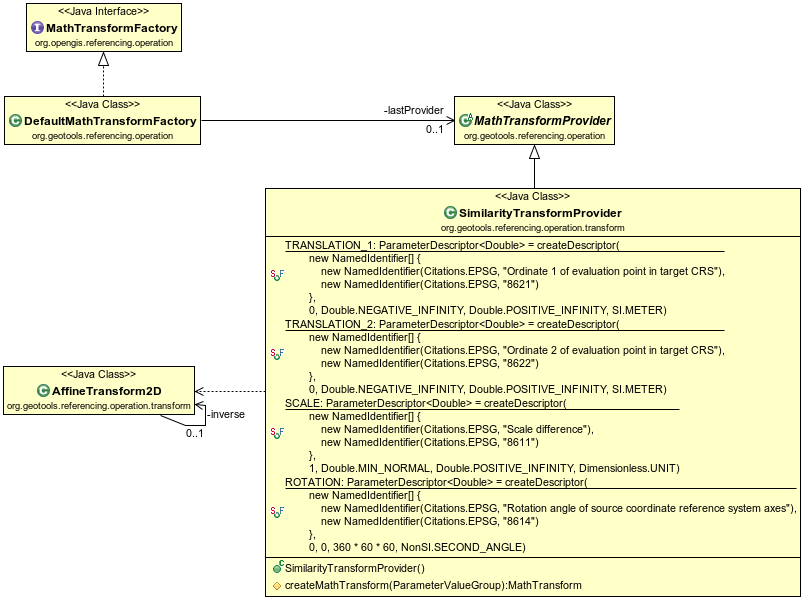
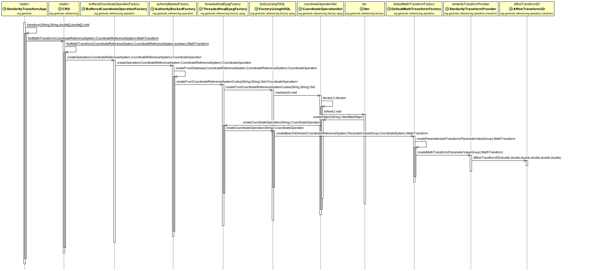
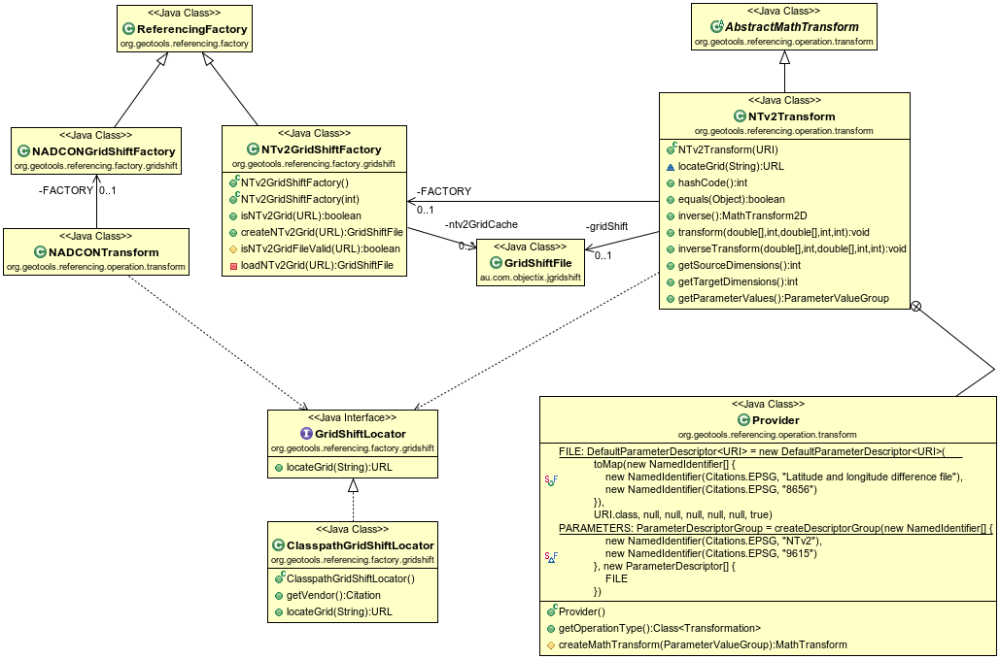
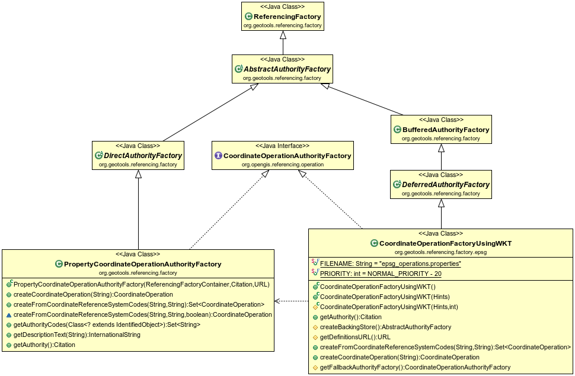
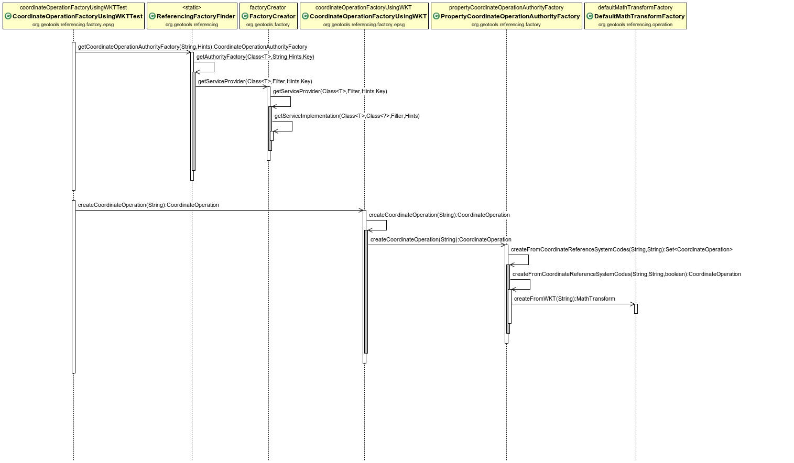

Desenvolupament a GeoTools
==========================

GeoTools està construït de manera que la seva funcionalitat pugui ser ampliada mitjançant plug-ins sense haver de modificar el codi base. D'aquesta manera, es poden afegir noves implementacions de les API existents simplement afegint les noves llibreries al classpath. 

GeoTools utilitza un sistema de descoberta de noves implementacions estàndard de java, anomenat SPI (Service Provider Interface).

Les API defineixen una sèrie d'interfícies. Les diferents implementacions s'instancien mitjançant factories, que es registren a l'SPI per ser descobertes en temps d'execució.

Transformació de semblança
--------------------------

Les transformacions matemàtiques s'instancien mitjançant la implementació per defecte de la interfície ``MathTransformFactory``, anomenada ``DefaultMathTransformFactory``. Aquesta factoria crearà una ``MathTransform`` d'un tipus o un altre en funció dels paràmetres que rebi. La creació es produeix invocant el ``Provider``, concretament el seu mètode ``createMathTransform``.

Una transformació afí es defineix amb una matriu 3x3, de la següent forma:

.. math::
  :name: Matriu de transformació afí 2D.

  \begin{bmatrix} x' \\ y' \\ 1 \end{bmatrix} =
  \begin{bmatrix} m_{00} & m_{01} & m_{02} \\
  m_{10} & m_{11} & m_{12} \\ 0 & 0 & 1 \end{bmatrix}
  \begin{bmatrix} x \\ y \\ 1 \end{bmatrix}

La transformació de semblança es pot expressar com una transformació afí:

.. math::
  :name: Transformació de semblança expressada com a matriu de transformació afí 2D.

  \begin{bmatrix} x' \\ y' \\ 1 \end{bmatrix} =
  \begin{bmatrix} \alpha cos(\theta) & \alpha sin(\theta) & t_x \\
  -\alpha sin(\theta) & \alpha cos(\theta) & t_y \\ 0 & 0 & 1 \end{bmatrix}
  \begin{bmatrix} x \\ y \\ 1 \end{bmatrix}

on :math:`t_x` i :math:`t_y` és la traslació, :math:`\theta` la rotació, i :math:`\alpha` el factor d'escala.

Per tant, l'estratègia d'implementació ha consistit, simplement, a crear un ``SimilarityTransformProvider`` que calcula els valors de la matriu per instanciar una ``AffineTransform2D`` seguint l'equivalència anterior.

Internament, doncs, GeoToools tractarà amb una transformació afí, a tots els efectes, encara que hagi estat creada a partir d'una definició de transformció de semblança.

Un altre objectiu del ``Provider`` és definir els noms i identificadors EPSG de que es composa aquesta transformació:

* *Similarity transformation* (EPSG::9621):

  * *Ordinate 1 of evaluation point in target CRS* (EPSG::8621)
  * *Ordinate 2 of evaluation point in target CRS* (EPSG::8622)
  * *Scale difference* (EPSG::8611)
  * *Rotation angle of source coordinate reference system axes* (EPSG::8614)

El descriptor de la operació permet a ``MathTransformFactory`` deduïr quin tipus de ``MathTransformProvider`` ha d'invocar, i els descriptors de cada paràmetre permeten comprovar que els valors es troben dins dels rangs permesos.



   Classes rellevants per a la transformació de semblança.

Javadoc
.......

.. toctree::
   javadoc/SimilarityTransformProvider

Determinació i instanciació d'una transformació
...............................................

A GeoTools, la instanciació d'una operació de coordenades s'acostuma a fer amb aquesta crida::

  CRS.findMathTransform(sourceCRS, targetCRS)

Al darrera d'aquesta crida aparentment senzilla, s'engega un costós procés per determinar de forma automàtica quina és la millor de les operacions disponibles. Per aquest motiu, un cop determinada, s'emmagatzema el resultat en memòria. ``BufferedCoordinateOperationFactory`` s'encarrega de la gestió d'aquesta `caché` d'operacions, i, per tant, és la primera factoria a ser invocada. Si no es troba la operació, es delegarà en ``AuthorityBackedFactory``, que conté una base de dades (de fet, una *backingFactory*) procedent d'una autoritat. Així, el primer pas per a la resolució de la operació es farà consultant la base de dades d'aquesta autoritat.

L'autoritat per defecte és EPSG. La consulta a la base de dades EPSG és *multithread*, per no representar un coll d'ampolla en entorns on s'han de resoldre consultes simultànies (per exemple, quan el codi s'executa dins un servidor web), i fa servir un gestor anomenat HSQL, lleuger, i basat en fitxer. De la consulta a la BDD s'encarreguen les classes ``ThreadedHsqlEpsgFactory`` i ``FactoryUsingHSQL``.

S'extreuen de la Base de Dades totes les operacions disponibles entre els dos CRS donats, per ordre ascendent d'error associat (per tant, les operacions més exactes s'avaluen abans). Les dades sobre les operacions es carreguen a un ``CoordinateOperationSet``. Per estalviar recursos, les operacions matemàtiques en si només s'instanciaran el primer cop que siguin requerides. S'itera llavors sobre aquesta col·lecció, fins que s'aconsegueix instanciar una de les operacions.

Pot ser que no es pugui instanciar alguna de les primeres operacions, bé perquè GeoTools no implementa l'algorisme (com passava amb la semblança fins ara), perquè no disposa de les dades necessàries (pensem, per exemple, en una transformació NTv2 de la que no disposem de la malla), o perquè els paràmetres de la BDD són erronis o incoherents (podria passar).

És aquest iterador ``Iter`` el que intenta instanciar les operacions, fent una crida de nou a ``ThreadedHsqlEpsgFactory`` i ``FactoryUsingHsql``. En aquesta ocasió, aquestes classes s'encarreguen d'adaptar el contingut de la BDD a les característiques finals de l'operació demanada. Per exemple, garantint cert ordre dels eixos [(lat, lon) vs. (lon, lat)], o convertint unitats.

Podria ser que no es trobés la operació directa a la Base de Dades. Llavors es procediria a buscar camins indirectes per resoldre la operació (per exemple, un camí típic de transformació és passar de coordenades projectades a geodèsiques, a geocèntriques, fer un canvi de base, i enrera).

En el noste cas, la operació EPSG::5166 es troba a la base de dades EPSG, és directa, i sabem resoldre-la. Es crida a ``DefaultMathTransformFactory``, que examinant els paràmetres, arriba al nostre nou ``SimilarityTransformProvider``, que retorna una ``AffineTransform2D``.

En el camí de tornada, ``BufferedCoordinateOperationFactory`` desarà el resultat a la seva caché, de manera que, quan es torni a demanar la mateixa operació en crides posteriors, no caldrà tornar a consultar la base de dades EPSG en busca dels paràmetres.



   Descoberta i instanciació d'una transformació matemàtica.


Transformacions de malla
------------------------

Per fer la transformació de malla NTv2 s'ha utilitzat la llibreria `jGridShift <http://jgridshift.sourceforge.net/>`_. Aquesta llibreria té dues formes d'operar amb les malles.

La primera consisteix a anar accedint al fitxer de malla cada vegada que se solicita la transformació d'una coordenada:

.. code-block:: java

  GridShiftFile gsf = new GridShiftFile();
  RandomAccessFile raf = new RandomAccessFile("100800401.gsb","r");
  gsf.loadGridShiftFile(raf);

Aquest mètode estalvia temps i memòria en la càrrega de la malla, ja que només es consulta la part del fitxer necessària en cada moment. Però una transformació d'una col·lecció important de punts implica un accés repetit a disc, el que acaba enlentint notablement les operacions de reprojecció al vol.

El segon mètode consisteix a carregar tota la malla en memòria:

.. code-block:: java

  GridShiftFile gsf = new GridShiftFile();
  InputStream in = new URL("file:100800401.gsb").openStream();
  gsf.loadGridShiftFile(in, false);
  in.close();

Aquest mètode necessita tanta memòria com gran és el fitxer de malla, i la càrrega inicial és costosa en temps, havent de processar tot el fitxer.

S'ha optat doncs per una solució òptima que combina tots dos mètodes:

* Utilitza el primer mètode per comprovar la integritat del fitxer de malla tan aviat com sigui possible. Fer aquesta comprovació és ràpid, no costa memòria, i evita acabar prenent com a bo un fitxer de malla corrupte, el que derivaria en errors posteriors de transformació no recuperables. D'aquesta manera, si el fitxer no es reconeix com a correcte, simplement s'informa l'usuari amb un ``warning``, i es descarta el seu ús, utilitzant el següent mètode de transformació disponible (vegeu com s'itera sobre un ``CoordinateOperationSet`` a `Determinació i instanciació d'una transformació`_).

* Utilitza el segon mètode per carregar tota la malla en memòria, optimitzant el rendiment en les transformacions (pensem, per exemple, que la reprojecció al vol d'un servei WMS requereix la transformació ràpida de molts punts). La càrrega total en memòria es retarda el més possible, només es carrega quan és realment necessari, en el moment de realitzar la primera transformació.

* Procura una gestió eficient dels recursos de memòria, mitjançant un ``SoftHashMap`` que actua com a caché dels fitxers de malla carregats. Així, un cop carregada una malla, aquesta es mantindrà en memòria per a posteriors usos, però no indefinidament. Aquesta caché assegura la permanència dels elements (malles) accedits més recentment, però en cas que el sistema necessiti memòria per altres tasques, s'esporgaran els elements en desús. S'equilibra així l'ús de memòria amb els accessos a disc.



   Classes rellevants per a les transformacions de malla (NTv2 i NADCON).

Al diagrama de classes observem que s'ha creat una nova transformació matemàtica, ``NTv2Transform``, que embolcalla la classe ``GridShiftFile`` de *jGridShift* i l'adapta per al seu ús com a ``MathTransform`` de GeoTools. Com que la operació és invertible, aquesta classe disposa dels mecanismes necessaris per aplicar la transformació en ambdues direccions.

``NTv2Transform`` també conté el corresponent ``Provider``, que, tal com s'ha vist a l'apartat anterior, conté els descriptors EPSG de la transformació i els seus paràmetres, i el mètode per a instanciar-la. En aquest cas els descriptors són:

* *NTv2* (EPSG::9615):

  * *Latitude and longitude difference file* (EPSG::8656)

Una característica d'aquest tipus de transformació és que depèn d'un recurs extern, el fitxer de malla, que ha de proporcionar l'usuari. Depenent de l'entorn d'execució (GeoTools, GeoServer, uDig, etc.), aquest recurs pot haver de localitzar-se en diferents llocs.

S'ha creat una interfície ``GridShiftLocator`` amb un sol mètode, ``locateGrid()``, que, donat un nom d'un fitxer, retorna la localització (path absolut o URL) del recurs. I s'ha provist una implementació per defecte, el ``ClasspathGridShitfLocator``, que farà una cerca del fitxer de malla a tot el classpath. Així, ubicant el ``.gsb`` al classpath, GeoTools el detectarà automàticament quan sigui necessari.

``NTv2Transform`` té un mètode ``locateGrid()`` que fa ús dels ``GridShiftLocator`` existents per cercar els fitxers de malla. Està previs que hi pugui haver al sistema diverses implementacions de ``GridShiftLocator``, cadascuna amb una prioritat diferent, de manera que el mètode ``locateGrid()`` els utilitzi per ordre fins trobar el recurs. Veurem aquesta situació al `Desenvolupament a GeoServer`.

En tot cas, després de localitzar el recurs, ``NTv2Transform`` invocarà la classe ``NTv2GridShiftFactory``, encarregada de comprovar la integritat del fitxer, de la seva càrrega en memòria quan sigui oportú, i de gestionar la *softCache* de malles descrita anteriorment.

GeoTools també incorporava una implementació de transformacions de malla en format NADCON. Aquesta funcionalitat no s'aprofitava a GeoServer perquè hi mancava una forma flexible d'indicar la localització dels fitxers de malla i de gestionar la seva càrrega en memòria.

Per tant, s'ha aprofitat l'avinentesa per crear una ``NADCONGridShiftFactory`` i adaptar la ``NADCONTransform`` existent per fer ús de ``GridShiftLocator``, de manera anàloga a com ho fa ``NTv2Transform``. Aquest treball amb malles NADCON ha estat realitzada per Andrea Aime, i no forma part d'aquest encàrrec, pel que no entrarem en més detalls. Valgui destacar, però, com aquesta solució ha contribuït a la millora d'altres funcionalitats a GeoTools i GeoServer.

Javadoc
.......

.. toctree::
   javadoc/NTv2Transform
   javadoc/NTv2Transform.Provider
   javadoc/NTv2GridShiftFactory
   javadoc/GridShiftLocator
   javadoc/ClasspathGridShiftLocator

Invocació d'una transformació de coordenades
............................................

En la secció anterior hem vist com s'instancia una operació matemàtica a partir de la BDD EPSG. Per a les transformacions de malla, el procés és exactament el mateix. Vegem ara com s'utilitza aquesta transformació.

El mètode habitual, un cop s'ha obtingut la ``MathTransform``, és invocar:

.. code-block:: java
  
  int nPts = 1;
  double[] srcPts = {41.769413434, 2.188547199};
  double[] dstPts = new double[2];
  mt.transform.transform(srcPts, 0, dstPts, 0, nPts);

El diagrama de seqüència mostra la invocació d'una transformació ``NTv2`` utilitzant el fitxer *sped2et.gsb* procedent del CNIG, i que es troba registrat a la BDD EPSG per a les transformacions entre els CRS ``EPSG:4230`` i ``EPSG:4258``.

.. figure:: diagrams/GEOT-GridShift_Sequence.PNG
   :target: _images/GEOT-GridShift_Sequence.PNG
   :align: center

   Seqüència d'invocació d'una transformació de coordenades.

S'observa com la transformació ``NTv2Transform`` acaba fent una crida a ``GridShiftFile``, classe provinent de *jGridShift*, que és la que efectua realment la transformació.

Abans però observem que ``NTv2Transform`` no es crida directament, sinó a través de dues instàncies de ``ConcatenatedTransformDirect2D``. Aquesta construcció, creada automàticament per GeoTools en el procés descrit en l'apartat anterior, adapta l'ordre dels eixos de coordenades, de manera que aquest particular sigui transparent per a l'usuari.


Operacions de coordenades personalitzades
-----------------------------------------

Com hem vist, GeoTools utilitza la Base de Dades EPSG com a primera font de dades autoritativa per descobrir la millor transformació en cada cas.

En ocasions, els usuaris disposen de transformacions pròpies, més precises o més actuals que les registrades a EPSG. O, simplement, desitgen poder controlar el procés al marge del mecanisme de descoberta automàtica que utilitza GeoTools per defecte, definint i forçant l'ús d'una transformació personalitzada.

Com hem vist, GeoTools utilitza factories del tipus ``CoordinateOperationFactory``, encarregades de construïr les operacions de coordenades. Per tal de modificar el comportament per defecte, hem introduït una nova ``CoordinateOperationFactoryUsingWKT`` amb una prioritat més alta que ``ThreadedEpsgHsqlFactory``.

D'aquesta manera, abans de consultar la BDD EPSG, es consultarà un fitxer amb definicions personalitzades. En cas de no existir aquest fitxer, la factory no s'activarà. I, en cas de trobar el fitxer però no trobar en ell una definició personalitzada per a una operació determinada, ``CoordinateOperationFactoryUsingWKT`` incorpora un mecanisme intern, ``getFallbackAuthorityFactory()``, que delegarà en la següent ``CoordinateOperationFactory`` de menor prioritat. És a dir, s'utilitzarà ``ThreadedEpsgHsqlFactory``, que accedeix a la BDD EPSG oficial.

S'ha proveït GeoTools d'aquesta nova factory, però se li ha assignat una prioritat baixa per defecte, de manera que no interfereixi amb el comportament esperat fins ara per a la majoria de desenvolupadors. En tot cas, existeix un mecanisme senzill per registrar qualsevol factory amb un nivell de prioritat diferent, el que permet utilitzar aquesta característica quan sigui necessari.

La localització del fitxer amb les definicions personalitzades es pot indicar mitjançant una variable d'entorn de la màquina java en temps d'execució, o bé es pot indicar per codi, o bé, si no es defineix, s'entendrà que es troba en algun lloc del classpath. El fitxer amb les definicions personalitzades porta per nom, per defecte, :file:`epsg_operations.properties`.



   Classes rellevants per a la gestió d'operacions de coordenades personalitzades.

Al diagrama de classes s'observa que ``CoordinateOperationFactoryUsingWKT`` extén ``DeferredAuthorityFactory`` que al seu torn deriva de ``BufferedAuthorityFactory``. Aquesta herència incorpora novament funcionalitats de caché per fer una gestió òptima de l'ús de memòria. Com en altres casos, la lectura d'una operació personalitzada en WKT es retarda fins que no sigui estrictament necessària, i posteriorment es manté en memòria amb un temporitzador que monitoritza el seu ús. Si passats 15 minuts una operació no s'ha utilitzat, s'allibera la memòria, i es tornarà a construïr la operació a partir del WKT quan sigui necessari. Això beneficia les situacions amb molta càrrega, on es manté en memòria només allò que s'està utilitzant repetidament en un moment donat.

En realitat, ``CoordinateOperationFactoryUsingWKT`` només gestiona la localització del fitxer de definicions i els mecanismes de caché descrits. La classe que realment processa les definicions personalitzades per construïr les ``MathTransforms`` corresponents és la classe ``PropertyCoordinateOperationAuthorityFactory``, que s'utilitza des de la classe de més alt nivell com a *backing factory* (que significa, aquella que es recolza en dades). D'aquesta manera, el processat de base queda desvinculat de la gestió dels recursos, donant lloc a una arquitectura més flexible.

Operacions personalitzades. Sintaxi i exemples
..............................................

Cada línia al fitxer :file:`epsg_operations.properties` descriu una operació de coordenades, consistent en un `CRS origen`, un `CRS destí`, i una transformació matemàtica amb els seus corresponents valors de paràmetres. La sintaxi general és::

  <source crs code>,<target crs code>=<WKT math transform>

Les transformacions matemàtiques estan descrites en la sintaxi `Well-Known Text <http://www.geoapi.org/3.0/javadoc/org/opengis/referencing/doc-files/WKT.html>`_. Els noms de paràmetres i rangs de valors vàlids es poden consultar a `EPSG Geodetic Parameter Registry <http://www.epsg-registry.org/>`_.

Exemples
````````

Declarant una malla NTv2 personalitzada::

  4230,4258=PARAM_MT["NTv2", \
    PARAMETER["Latitude and longitude difference file", "100800401.gsb"]]

Transformació de semblança, operant directament entre dues projeccions UTM::

  23031,25831=PARAM_MT["Similarity transformation", \ 
    PARAMETER["Ordinate 1 of evaluation point in target CRS", -129.549], \
    PARAMETER["Ordinate 2 of evaluation point in target CRS", -208.185], \
    PARAMETER["Scale difference", 1.00000155], \
    PARAMETER["Rotation angle of source coordinate reference system axes", 1.56504]]

Transformació geocèntrica, precedida per una conversió d'el·lipsoidals a geocèntriques, i posterior conversió de geocèntriques a el·lipsoidals. El resultat és una concatenació de tres transformacions::

  4230,4258=CONCAT_MT[PARAM_MT["Ellipsoid_To_Geocentric", \
    PARAMETER["dim", 2], \
    PARAMETER["semi_major", 6378388.0], \
    PARAMETER["semi_minor", 6356911.9461279465]], \
  PARAM_MT["Position Vector transformation (geog2D domain)", \
    PARAMETER["dx", -116.641], \
    PARAMETER["dy", -56.931], \
    PARAMETER["dz", -110.559], \
    PARAMETER["ex", 0.8925078166311858], \
    PARAMETER["ey", 0.9207660950870382], \
    PARAMETER["ez", -0.9166407989620964], \
    PARAMETER["ppm", -3.5200000000346066]], \
  PARAM_MT["Geocentric_To_Ellipsoid", \
    PARAMETER["dim", 2], \
    PARAMETER["semi_major", 6378137.0], \
    PARAMETER["semi_minor", 6356752.314140356]]
  ]

Cada operació pot ser descrita en una única línia, o es pot trencar en diverses línies per fer-les més llegibles, afegint una barra inversa "\\" al final de cada línia, que indiqui la seva continuació, com als exemples anteriors.

Javadoc
.......

.. toctree::
   javadoc/PropertyCoordinateOperationAuthorityFactory
   javadoc/CoordinateOperationFactoryUsingWKT

Instanciació de factories
.........................

La manera d'invocar factories a GeoTools és a través d'unes classes anomenades ``FactoryFinders``. Per al mòdul de referenciació, s'utilitza el ``ReferencingFactoryFinder``. Per exemple, per recuperar la factoria encarregada de crear operacions de coordenades basades l'autoritat EPSG, es fa servir:

.. code-block:: java

   ReferencingFactoryFinder.getCoordinateOperationAuthorityFactory("epsg", null);

Aquest *finder* recorrerà a un registre de factories que manté referències cap a totes les factories registrades al sistema. Per escollir la factoria, es filtra segons el seu tipus, i, en cas d'haver-n'hi més d'una, s'escull la que està registrada amb prioritat més alta.

Un cop determinada, es delega la seva creació a ``FactoryCreator`` (que no és més que una factoria de factories). La primera seqüencia del diagrama mostra el moment en que ``FactoryCreator`` està recuperant la implementació de ``CoordinateOperationFactoryUsingWKT``.



   Instanciació d'una factoria d'operacions de coordenades, i d'una transformació matemàtica a partir de la seva definició en WKT.

Instanciació d'una transformació matemàtica personalitzada
..........................................................

A la segona seqüència de la figura es mostra com ``CoordinateOperationFactoryUsingWKT`` crea una operació de coordenades. Primer cercarà a la caché pròpia i, si no la troba, encarregarà la seva creacio a ``PropertyCoordinateOperationAuthorityFactory``. Aquesta cercarà la definició al fitxer de *properties*, i llegirà la transformació matemàtica en format WKT. De la creació de la transformació matemàtica s'encarrega ``DefaultMathTransformFactory`` que té un mètode capaç de crear ``MathTransform``  partir d'una cadena de text en WKT.
