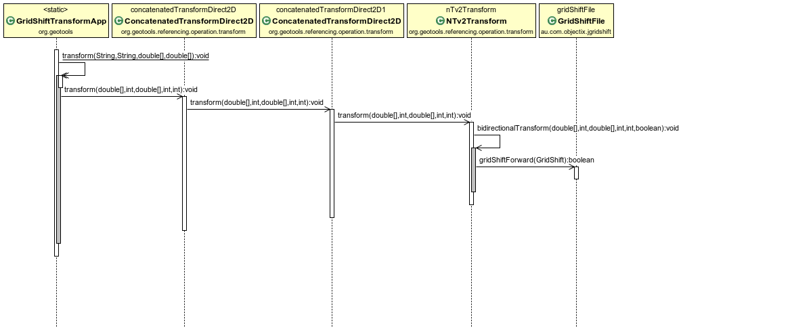

Desenvolupament a GeoTools
==========================

GeoTools està construït de manera que la seva funcionalitat pugui ser ampliada mitjançant plug-ins sense haver de modificar el codi base. D'aquesta manera, es poden afegir noves implementacions de les API existents simplement afegint les noves llibreries al classpath. 

GeoTools utilitza un sistema de descoberta de noves implementacions estàndard de java, anomenat SPI (Service Provider Interface).

Les API defineixen una sèrie d'interfícies. Les diferents implementacions s'instancien mitjançant factories, que es registren a l'SPI per ser descobertes en temps d'execució.

Transformació de semblança
--------------------------

Les transformacions matemàtiques s'instancien mitjançant la implementació per defecte de la interfície ``MathTransformFactory``, anomenada ``DefaultMathTransformFactory``. Aquesta factoria crearà una ``MathTransform`` d'un tipus o un altre en funció dels paràmetres que rebi. La creació es produeix invocant el ``Provider``, concretament el seu mètode ``createMathTransform``.

Una transformació afí es defineix amb una matriu 3x3, de la següent forma:

.. math::
  :name: Matriu de transformació afí 2D.

  \begin{bmatrix} x' \\ y' \\ 1 \end{bmatrix} =
  \begin{bmatrix} m_{00} & m_{01} & m_{02} \\
  m_{10} & m_{11} & m_{12} \\ 0 & 0 & 1 \end{bmatrix}
  \begin{bmatrix} x \\ y \\ 1 \end{bmatrix}

La transformació de semblança es pot expressar com una transformació afí:

.. math::
  :name: Matriu de transformació afí 2D.

  \begin{bmatrix} x' \\ y' \\ 1 \end{bmatrix} =
  \begin{bmatrix} \alpha cos(\theta) & \alpha sin(\theta) & t_x \\
  -\alpha sin(\theta) & \alpha cos(\theta) & t_y \\ 0 & 0 & 1 \end{bmatrix}
  \begin{bmatrix} x \\ y \\ 1 \end{bmatrix}

on :math:`t_x` i :math:`t_y` és la traslació, :math:`\theta` la rotació, i :math:`\alpha` el factor d'escala.

Per tant, l'estratègia d'implementació ha consistit, simplement, a crear un ``SimilarityTransformProvider`` que calcula els valors de la matriu per instanciar una ``AffineTransform2D`` seguint l'equivalència anterior.

Internament, doncs, GeoToools tractarà amb una transformació afí, a tots els efectes, encara que hagi estat creada a partir d'una definició de transformció de semblança.

Un altre objectiu del ``Provider`` és definir els noms i identificadors EPSG de que es composa aquesta transformació:

* Similarity transformation (EPSG::9621):

  * *Ordinate 1 of evaluation point in target CRS* (EPSG::8621)
  * *Ordinate 2 of evaluation point in target CRS* (EPSG::8622)
  * *Scale difference* (EPSG::8611)
  * *Rotation angle of source coordinate reference system axes* (EPSG::8614)

El descriptor de la operació permet a ``MathTransformFactory`` deduïr quin tipus de ``MathTransformProvider`` ha d'invocar, i els descriptors de cada paràmetre permeten comprovar que els valors es troben dins dels rangs permesos.

.. figure:: diagrams/GEOT-Similarity_Class.PNG
   :target: _images/GEOT-Similarity_Class.PNG
   :align: center

   Classes rellevants per a la transformació de semblança.

Javadoc
.......

.. toctree::
   javadoc/SimilarityTransformProvider

Ús
..

A GeoTools, la instanciació d'una operació de coordenades s'acostuma a fer amb aquesta crida::

  CRS.findMathTransform(sourceCRS, targetCRS)

Al darrera d'aquesta crida aparentment senzilla, s'engega un costós procés per determinar de forma automàtica quina és la millor de les operacions disponibles. Per aquest motiu, un cop determinada, s'emmagatzema el resultat en memòria. ``BufferedCoordinateOperationFactory`` s'encarrega de la gestió d'aquesta `caché` d'operacions, i, per tant, és la primera factoria a ser invocada. Si no es troba la operació, es delegarà en ``AuthorityBackedFactory``, que conté una base de dades (de fet, una *backingFactory*) procedent d'una autoritat. Així, el primer pas per a la resolució de la operació es farà consultant la base de dades d'aquesta autoritat.

L'autoritat per defecte és EPSG. La consulta a la base de dades EPSG és *multithread*, per no representar un coll d'ampolla en entorns on s'han de resoldre consultes simultànies (per exemple, quan el codi s'executa dins un servidor web), i fa servir un gestor anomenat HSQL, lleuger, i basat en fitxer. De la consulta a la BDD s'encarreguen les classes ``ThreadedHsqlEpsgFactory`` i ``FactoryUsingHSQL``.

S'extreuen de la Base de Dades totes les operacions disponibles entre els dos CRS donats, per ordre ascendent d'error associat (per tant, les operacions més exactes s'avaluen abans). Les dades sobre les operacions es carreguen a un ``CoordinateOperationSet``. Per estalviar recursos, les operacions matemàtiques en si només s'instanciaran el primer cop que siguin requerides. S'itera llavors sobre aquesta col·lecció, fins que s'aconsegueix instanciar una de les operacions.

Pot ser que no es pugui instanciar alguna de les primeres operacions, bé perquè GeoTools no implementa l'algorisme (com passava amb la semblança fins ara), perquè no disposa de les dades necessàries (pensem, per exemple, en una transformació NTv2 de la que no disposem de la malla), o perquè els paràmetres de la BDD són erronis o incoherents (podria passar).

És aquest iterador ``Iter`` el que intenta instanciar les operacions, fent una crida de nou a ``ThreadedHsqlEpsgFactory`` i ``FactoryUsingHsql``. En aquesta ocasió, aquestes classes s'encarreguen d'adaptar el contingut de la BDD a les característiques finals de l'operació demanada. Per exemple, garantint cert ordre dels eixos [(lat, lon) vs. (lon, lat)], o convertint unitats.

Podria ser que no es trobés la operació directa a la Base de Dades. Llavors es procediria a buscar camins indirectes per resoldre la operació (per exemple, un camí típic de transformació és passar de coordenades projectades a geodèsiques, a geocèntriques, fer un canvi de base, i enrera).

En el noste cas, la operació EPSG::5166 es troba a la base de dades EPSG, és directa, i sabem resoldre-la. Es crida a ``DefaultMathTransformFactory``, que examinant els paràmetres, arriba al nostre nou ``SimilarityTransformProvider``, que retorna una ``AffineTransform2D``.

En el camí de tornada, ``BufferedCoordinateOperationFactory`` desarà el resultat a la seva caché, de manera que, quan es torni a demanar la mateixa operació en crides posteriors, no caldrà tornar a consultar la base de dades EPSG en busca dels paràmetres.

.. figure:: diagrams/GEOT-Similarity_Sequence.PNG
   :target: _images/GEOT-Similarity_Sequence.PNG
   :align: center

   Descoberta i instanciació d'una transformació matemàtica.

Transformacions de malla
------------------------

Classes
.......

.. figure:: diagrams/GEOT-GridShift_Class.PNG
   :target: _images/GEOT-GridShift_Class.PNG
   :align: center

   Classes rellevants per a les transformacions de malla (NTv2 i NADCON).

Javadoc
.......

.. toctree::
   javadoc/NTv2GridShiftFactory

Ús
..

   Seqüència d'invocació d'una transformació de coordenades.

Operacions de coordenades personalitzades
-----------------------------------------

Classes
.......

.. figure:: diagrams/GEOT-WKTOperation_Class.PNG
   :target: _images/GEOT-WKTOperation_Class.PNG
   :align: center

   Classes rellevants per a la gestió d'operacions de coordenades personalitzades.

Javadoc
.......

.. toctree::

Ús
..

.. figure:: diagrams/GEOT-WKTOperation_Sequence.PNG
   :target: _images/GEOT-WKTOperation_Sequence.PNG
   :align: center

   Instanciació d'una factoria d'operacions de coordenades, i d'una transformació matemàtica a partir de la seva definició en WKT.
