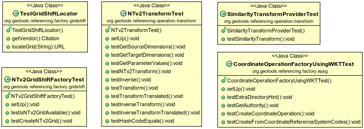
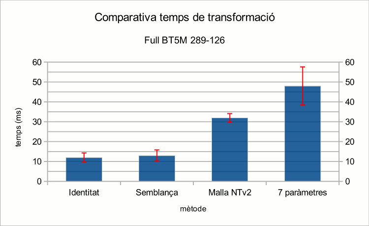
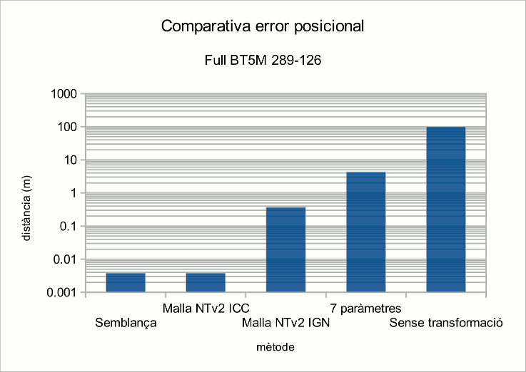
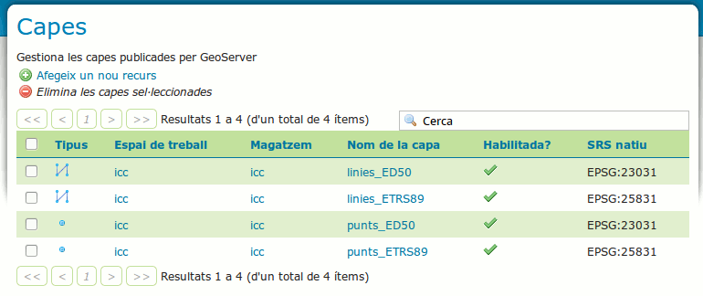
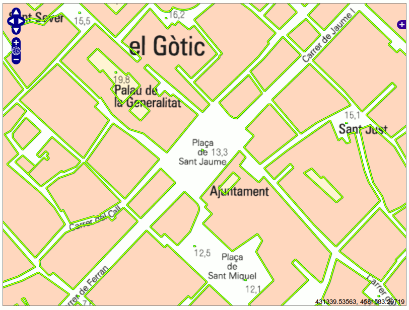
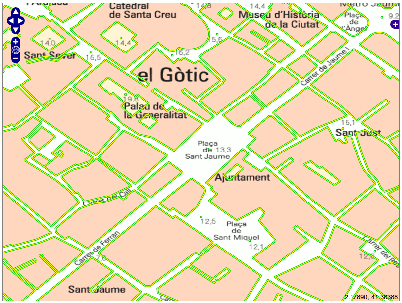

Conjunt de proves realitzades
=============================

S'han realitzat proves per verificar el comportament del codi des de diferents punts de vista.

En primer lloc, tot el codi aportat a GeoTools i a GeoServer ha d'anar acompanyat d'un conjunt de tests unitaris realitzats amb `JUnit <http://www.junit.org/>`_ que tinguin una cobertura suficientment significativa, però que alhora siguin d'un temps d'execució suficientment acotat que permetin executar-los amb assiduitat junt amb la resta de tests unitaris del projecte (per exemple, en els diversos serveis d'integració contínua de que disposa la comunitat de desenvolupadors). Aquests tests unitaris, doncs, formen part del codi font de l'aplicació, i es troben als repositoris de codi oficials dels projectes.

La resta de proves realitzades amb GeoTools són més específiques per al cas d'ús de l'ICC: Tests de rendiment i de precisió, comparant el temps invertit i l'error associat a les diferents alternatives de transformació (7 paràmetres, malla ICC, malla IGN, i semblança). Per a aquestes proves de rendiment i precisió s'ha desenvolupat una petita aplicació basada en GeoTools, que es pot descarregar, junt amb el codi font d'aquest document, a:

  https://github.com/oscarfonts/gt-datumshift

Aquesta aplicació està basada en `maven <http://maven.apache.org/>`_, el que permet gestionar-ne les dependències, generar el projecte per a la seva càrrega a `eclipse <http://www.eclipse.org/>`_, o executar les proves des de la línia de comandes.

Per últim, s'ha desenvolupat una aplicació web basada en `OpenLayers <http://openlayers.org/>`_ que fa ús dels serveis WMS de GeoServer i els integra amb serveis WMS externs, per comprovar que la funcionalitat final és l'esperada, i que s'integra bé amb altres serveis i aplicacions.

Tests unitaris
--------------

Desenvolupats en `jUnit`, formen part del codi font dels projectes. S'han incorporat els següents tests:

   Classes encarregades dels tests unitaris.

* `SimilarityTransformProviderTest`: Comprova que, donats un conjunt de paràmetres vàlids per a una transformació de tipus `EPSG:9621`, la factoria de transformacions matemàtiques utilitzarà `SimilarityTransformProvider` per crear la transformació. També realitza la transformació d'un punt conegut per comprovar que l'operació matemàtica resultant es realitza correctament.

* `NTv2TransformTest`: Comprova tots els mètodes públics de `NTv2Transform`: Dimensions, valors de paràmetres, operació inversa, etc. Utilitza una malla d'exemple per transformar un punt conegut i comprovar la seva validesa.

* `NTv2GridShiftFactoryTest`: Comprova la càrrega d'un fitxer de malla en memòria. Comprova també la gestió correcta de situacions excepcionals: Fitxer de malla inexistent, fitxer de malla amb format erroni.

* `TestGridShiftLocator`: Comprova que és capaç de localitzar correctament un fitxer de malla com a un recurs extern.

* `CoordinateOperationFactoryUsingWKTTest`: Comprova que la classe és capaç de proveïr operacions a partir de les definicions en un fitxer de propietats. Comprova també que és capaç de recuperar el fitxer de propietats a diferents localitzacions, segons l'especificat al `javadoc` de la classe sotmesa a proves (veure ``CoordinateOperationFactoryUsingWKT`` a l'apartat `Javadoc`).

Tests de rendiment
------------------

Per efectuar els tests de rendiment, s'ha descarregat de `Vissir 3 <http://www.icc.cat/vissir3/>`_ un full de la Base Topogràfica 1:5 000, en concret el 289-126, situat aproximadament al centre de Barcelona. S'ha descarregat en format Shapefile, datum ED50. De les capes que formen aquesta base, s'ha escollit la capa més complexa, una capa amb 2.189 geometries linials i un pes (només fitxer `.shp`) d'aproximadament 1 Mb.

S'han comparat els temps de conversió d'aquesta capa des del CRS original, `EPSG:23031`, al CRS `EPSG:25831`, utilitzant els següents mètodes de transformació:

* **Identitat**: Una transformació afí amb la matriu identitat.
* **Semblança**: La transformació bidimensional de semblança oficial de l'ICC, `EPSG:5166`.
* **Malla NTv2**: La transformació de malla NTv2 oficial de l'ICC, `100800401.gsb`
* **7 paràmetres**: La transformació de 7 paràmetres escollida per GeoServer abans d'aquest desenvolupament.

El temps de conversió utilitzant un mateix mètode pot variar notablement entre execucions consecutives. Executant la conversió repetidament, s'observa que el temps de conversió disminueix a cada iteració, fins que arriba a un règim estacionari en que, tot i haver-hi certa variabilitat, els resultats són repetibles. Aquest comportament transitori inicial es deu a la pròpia gestió de recursos i de *caché* del sistema operatiu i de la màquina virtual, que no és objecte d'aquesta anàlisi.

Per tant, cada un dels mètodes s'ha executat 35 vegades, descartant les 10 primeres iteracions per arribar al règim estacionari, i calculant la mitjana i desviació estàndard del temps de conversió per a les 25 iteracions següents. Els resultats són:

   ============  ===========  ===================
   Mètode        temps mitjà  desviació estàndard
   ============  ===========  ===================
   Identitat           12 ms               2.3 ms
   Semblança           13 ms               2.8 ms
   Malla NTv2          32 ms               2.1 ms
   7 paràmetres        48 ms               9.6 ms
   ============  ===========  ===================

Cal tenir en compte que el temps de conversió depèn en gran mesura de l'entorn d'execució. Per tant, aquests temps no es poden prendre com a valors absoluts, sinó només a efectes comparatius entre els diferents mètodes.

   Temps de conversió mitjà (i desviació estàndard) entre diferents mètodes de transformació.

La transformació d'identitat no és immediata, perque dins del període mesurat també s'hi inclou el procés d'iterar sobre cada geometria, obrir-la, descomposar-la, i generar-ne una de nova, encara que sigui una còpia idèntica.

Observem que el temps invertit en una transformació de semblança és similar a aplicar la identitat. Per tant, el temps invertit en el càlcul en sí no és significatiu davant de les altres tasques associades a la transformació.

La transformació de malla NTv2 requereix una conversió de UTM a coordenades geodèsiques, l'aplicació de la malla, i una conversió inversa de geodèsiques a UTM. El cost d'aquest procés de transformació ja és notable, pel que per motius de rendiment és aconsellable utilitzar la transformació de semblança quan sigui possible (en la conversió directa de UTM a UTM).

Per últim, la transformació de 7 paràmetres, que obliga a passar a coordenades geocèntriques, és el procés més costós de tots. Aquí es poden veure els beneficis de la gestió avançada de la malla NTv2 en memòria, descrita en apartats anteriors, que minimitza els accessos a disc i per tant la fa més eficient.

Tests de precisió
-----------------

Quant a les proves de precisió, s'ha utilitzat el mateix full 1:5 000 (289-126). Aquest cop s'ha descarregat el full en els dos datums, ED50 i ETRS89. El procés ha consistit a convertir la capa d'ED50 a ETRS89 amb diferents mètodes, i, prenent com a referència la capa ETRS89 descarregada de l'ICC, calcular la distància punt a punt.

Per simplificar la comparació, s'ha escollit una capa de tipus punt. Entre les disponibles, s'ha escollit la que conté més elements (cotes), que compta amb 959 geometries puntuals.

Els mètodes utilitzats han estat:

* **Semblança**: La transformació bidimensional de semblança oficial de l'ICC, `EPSG:5166`.
* **Malla NTv2 ICC**: La transformació de malla NTv2 oficial de l'ICC,  `100800401.gsb`.
* **Malla NTv2 IGN**: Darrera versió de la transformació de malla `SPED2ETV2.gsb` per a Península i Balears.
* **7 paràmetres**: La transformació de 7 paràmetres escollida automàticament per GeoServer abans d'aquest desenvolupament.
* **Sense transformació**: Distàncies obtingudes en cas de no aplicar cap transformació de datum.

Els resultats mostren la mitjana i desviació estàndard obtingudes de calcular la distància entre cada un dels 959 parells de punts:

   ===================  =================  ===================
   Mètode               distància mitjana  desviació estàndard
   ===================  =================  ===================
   Semblança                       3.9 mm               1.4 mm
   Malla NTv2 ICC                  3.9 mm               1.4 mm
   Malla NTv2 IGN                 37.7 cm               1.9 cm
   7 paràmetres                   4.353 m                 8 mm
   Sense transformació          102.038 m               3.4 cm
   ===================  =================  ===================

Noteu que l'eix vertical de la figura s'expressa en escala logarítmica, degut a les grans variacions depenent del mètode aplicat. Tingueu present també que aquestes xifres són les obtingudes per al full indicat, i estrictament no són extrapolables a tot Catalunya.

   Discrepància mitjana en la posició entre els mètodes aplicats per GeoTools i la referència de l'ICC.

S'observa que les dues alternatives proporcionades per l'ICC (malla i semblança) són perfectament equiparables. Com cabria esperar, donen els mateixos resultats estadístics. Existeix una discrepància posicional del voltant dels 4 mm respecte la referència, un ordre de magnitud per sota de l'error associat a la pròpia transformació, i per tant, assumible.

També s'ha volgut valorar l'exactitud de la malla NTv2 publicada per l'IGN. Observem en aquest cas una discrepància mitjana d'uns 40 cm. Per tant, no aconsellable per a cartografies d'escales més grans a 1:5 000.

La transformació de 7 paràmetres utilizada per GeoServer abans d'incorporar els nous mètodes aquí descrits resultava en un error d'uns 4 metres. Per tant, la incorporació de les transformacions oficials ha reduït l'error de transformació en tres ordres de magnitud respecte al comportament anterior de GeoServer.

Per últim, s'ha mesurat l'error comès en no aplicar cap canvi de datum, que, com és ben sabut, és de l'ordre dels 100 metres.

Tests d'integració
------------------

Les proves anteriors s'han realitzat amb GeoTools. Per completar el joc de proves, cal verificar que aquest comportament també es dóna a GeoServer. s'ha realitzat una petita aplicació integrant en un mateix visor web:

* El servei WMS de Catastro.
* El servei WMS de l'ICC (en concret, la capa `mt5m` de `shagrat`).
* Capes publicades a GeoServer sense reprojecció.
* Capes publicades a GeoServer reprojectades al vol utilitzant tant la transformació de semblança com la transformació de malla.

S'han publicat doncs a GeoServer quatre capes WMS, a partir de quatre *shapefiles* descarregats directament de l'ICC: Es tracta de les dues capes (de punts i de línies) utilitzades en les proves anteriors, en els dos sistemes de referència (EPSG:23031, i EPSG:25831).

   Capes publicades a GeoServer.

S'ha creat un visor web basat en OpenLayers, amb les capes de Catastro i de `shagrat` com a base, i les capes provinents de GeoServer superposades amb transparència. El visor web està referit a EPSG:25831, i realitzarà totes les peticions WMS en aquest CRS. El servei WMS de GeoServer reprojectarà al vol els shapefiles originalment en EPSG:23031.

S'han simbolitzat les capes en ED50 en color groc, amb una línia d'un píxel de gruix, o un punt quadrat de 2 píxels de costat. I les capes en ETRS89 s'han simbolitzat en color verd, amb un gruix de 3 píxels per a les línies, i un símbol quadrat de 4 píxels de costat per als punts. Així, solapant les capes reprojectades sobre les no reprojectades, l'efecte visual serà un farcit groc sobre un marc verd d'un píxel de gruix.

   Prova funcional d'integració amb el servei WMS GeoServer (en EPSG:25831).

Observem que a l'escala 1:5 000 hi ha coincidència entre la imatge de `shagrat` i les de GeoServer. Observem també que tant la capa no reprojectada (en verd) com la capa reprojectada per GeoServer (en groc) coincideixen exctament, de manera que les geometries grogues apareixen perfectament emmarcades per les geometries verdes.

Per tant, podem assegurar que, a resulucions de 50 cm/píxel, els resultats entre una capa reprojectada ED50 => ETRS89 i una capa nativa en ETRS89 són indistingibles. Per apreciar discrepàncies visuals d'aproximadament un píxel, hem de realitzar peticions WMS amb una resolució al voltant dels 5 mm/píxel, en coherèhcia amb les proves de precisió realitzades (veure `Tests de precisió`_).

Amb el visor anterior, la reprojecció es realitza utilitzant la transformació de semblança. Per comprovar que els resultats també es mantenen utilitzant la transformació de malla, s'ha desenvolupat un visor idèntic a l'anterior, però utilitzant EPSG:4258 com a CRS de visualització. GeoServer, en haver de generar una imatge en coordenades geodèsiques, utilitza la transformació de malla. Observem que els resultats són equivalents.

   Prova funcional d'integració amb el servei WMS GeoServer (en EPSG:4258).

El codi JavaScript del visor OpenLayers és el següent:

.. code-block:: javascript

    var map;

    function init() {
    
        var bounds = new OpenLayers.Bounds(
            428673.85, 4580911.92,
            432179.44, 4583258.19
        );
        
        var options = {
            projection: "EPSG:25831",
            maxExtent: bounds,
            units: "m",
            maxResolution: 25
        };

        var shagrat = new OpenLayers.Layer.WMS(
            "Shagrat mtc5m",
            "http://shagrat.icc.es/lizardtech/iserv/ows?",
            {
               layers: 'mtc5m,',
               styles: '',
               srs: 'EPSG:25831',
               format: 'image/jpeg',
               transparent: true
            },
            {'opacity': 1, 'isBaseLayer': true}
        );

        var catastro = new OpenLayers.Layer.WMS(
            "Catastro",
            "http://www1.sedecatastro.gob.es/Cartografia/WMS/ServidorWMS.aspx?",
            {
               layers: 'Catastro',
               styles: '',
               srs: 'EPSG:25831',
               format: 'image/gif',
               transparent: true
            },
            {'opacity': 1, 'isBaseLayer': true, singleTile: true}
        );

        var gs = new OpenLayers.Layer.WMS(
            "ED50 => ETRS89",
            "/geoserver/wms",
            {
               layers: 'icc:linies_ED50,icc:punts_ED50',
               styles: '',
               srs: 'EPSG:25831',
               format: 'image/png',
               transparent: true
            },
            {'opacity': 1, 'isBaseLayer': false, singleTile: true}
        );

        var gs2 = new OpenLayers.Layer.WMS(
            "Referència en ETRS89",
            "/geoserver/wms",
            {
               layers: 'icc:linies_ETRS89,icc:punts_ETRS89',
               styles: '',
               srs: 'EPSG:25831',
               format: 'image/png',
               transparent: true
            },
            {'opacity': 1, 'isBaseLayer': false, singleTile: true}
        );

        map = new OpenLayers.Map('map', options);
        
        map.addLayers([catastro, shagrat, gs, gs2]);
        
        map.addControl(new OpenLayers.Control.LayerSwitcher());
        map.addControl(new OpenLayers.Control.MousePosition());
        
        map.zoomToExtent(bounds);
    }
