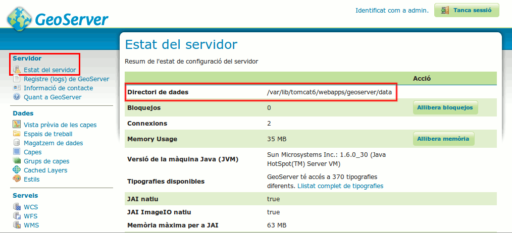

Guia ràpida de configuració a GeoServer
=======================================

Instruccions per a la incorporació dels fitxers de malla NTv2 i la transformació de semblança oficial de l'ICC a GeoServer 2.2.

1. Localitzeu el **Directori de dades** (``GEOSERVER_DATA_DIR``) a la vostra instal·lació de GeoServer. El podeu consultar a la interfície web d'administrador, sota **Servidor**, *Estat del servidor*:

2. Descarregueu-vos la `Malla NTv2 de transformació entre ED50 i ETRS89 <http://www.icc.cat/cat/Home-ICC/Inici/Geodesia/Recursos-geodesics>`_ i descomprimiu el seu contingut. Copieu els fitxers :file:`100800401.gsb` i :file:`800100401.gsb` dins :file:`GEOSERVER_DATA_DIR/user_projections`.

3. Editeu el fitxer :file:`GEOSERVER_DATA_DIR/user_projections/epsg_operations.properties` amb un editor de text. Si no existeix aquest fitxer, creeu-lo. Copieu el següent contingut dins el fitxer::

    4230,4258=PARAM_MT["NTv2", \
    PARAMETER["Latitude and longitude difference file", "100800401.gsb"]]
    4258,4230=PARAM_MT["NTv2", \
    PARAMETER["Latitude and longitude difference file", "800100401.gsb"]]
    23031,25831=PARAM_MT["Similarity transformation", \
    PARAMETER["Ordinate 1 of evaluation point in target CRS", -129.549], \
    PARAMETER["Ordinate 2 of evaluation point in target CRS", -208.185], \
    PARAMETER["Scale difference", 1.0000015504], \
    PARAMETER["Rotation angle of source coordinate reference system axes", 1.56504]]

4. Reinicieu GeoServer (o el contenidor d'aplicacions web en què estigui desplegat, com ara *tomcat*).

5. Per comprovar les noves definicions, aneu a la *Reprojection console* (a la interfície web, sota **Demos**), i cliqueu a *Show transformation details* per als següents parells de CRS:

  * *Source CRS* **EPSG:4230** i *Target CRS* **EPSG:4258**::

      PARAM_MT["NTv2", 
        PARAMETER["Latitude and longitude difference file", "100800401.gsb"]]

  * *Source CRS* **EPSG:4258** i *Target CRS* **EPSG:4230**::

      PARAM_MT["NTv2",
        PARAMETER["Latitude and longitude difference file", "800100401.gsb"]]

  * *Source CRS* **EPSG:23031** i *Target CRS* **EPSG:25831**::

      PARAM_MT["Affine", 
        PARAMETER["num_row", 3], 
        PARAMETER["num_col", 3], 
        PARAMETER["elt_0_0", 1.0000015503712145], 
        PARAMETER["elt_0_1", 0.00000758753979846734], 
        PARAMETER["elt_0_2", -129.549], 
        PARAMETER["elt_1_0", -0.00000758753979846734], 
        PARAMETER["elt_1_1", 1.0000015503712145], 
        PARAMETER["elt_1_2", -208.185]]
